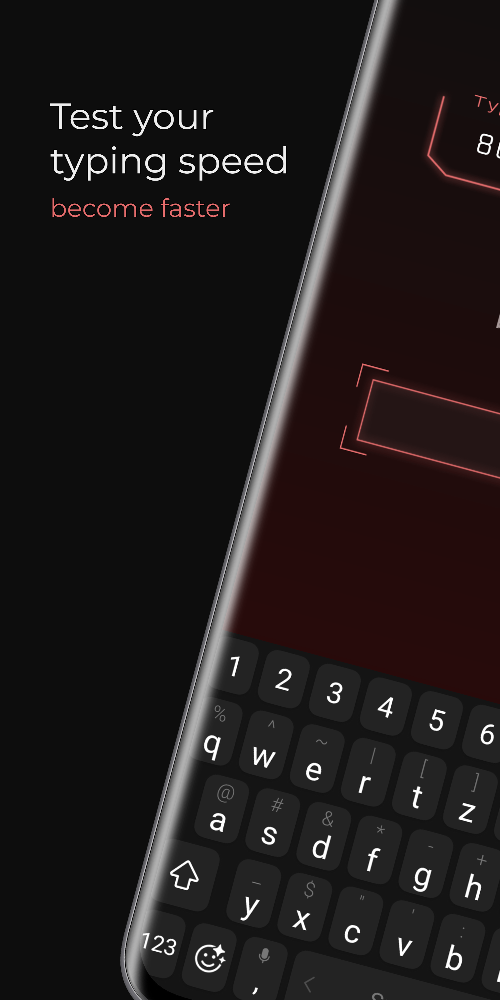
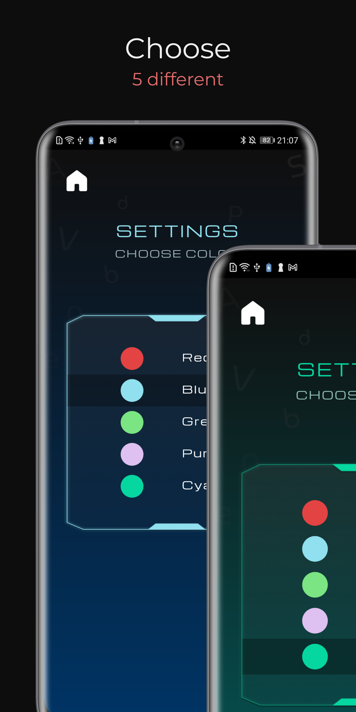
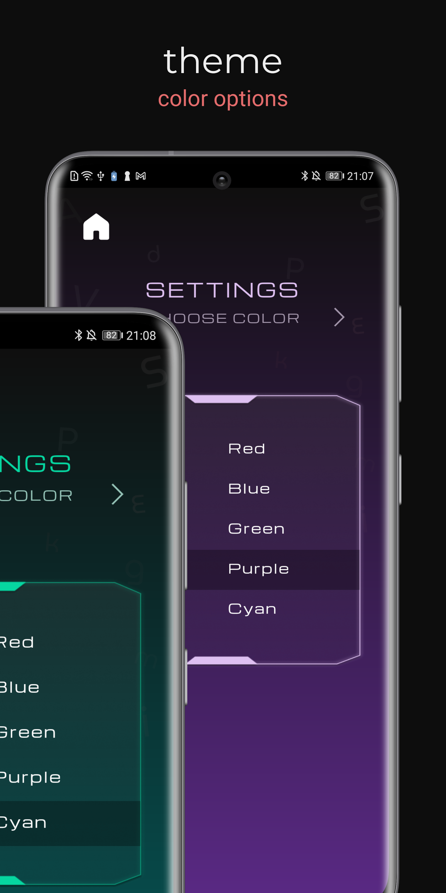
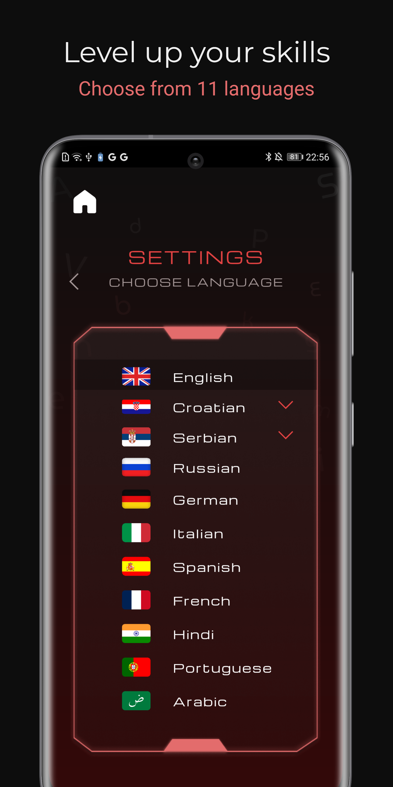
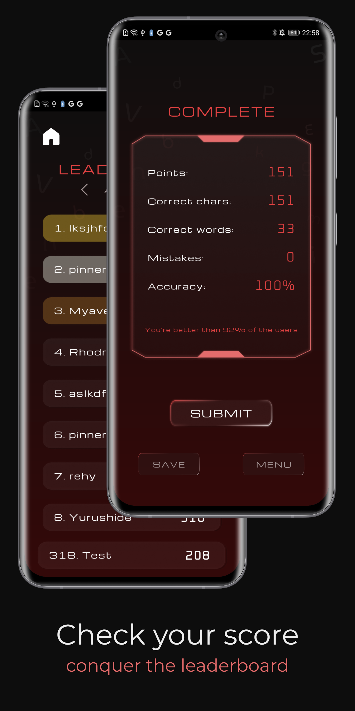
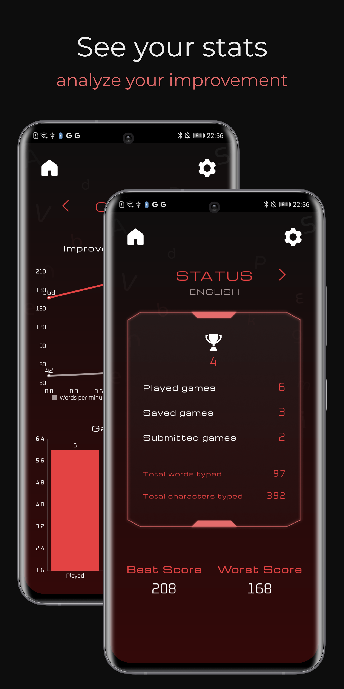
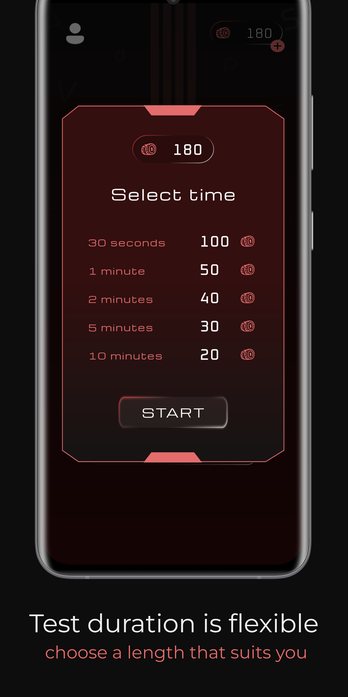

# Fast Typing

**Fast Typing** is your ultimate tool for enhancing typing speed and accuracy. Whether you're just starting or striving for typing mastery, this application offers a comprehensive range of features to meet your needs.

  

    
  

  

    
  

> **Please note**: The code for this application is private.

## ✨ Key Features
- **Interactive typing practice** with real-time feedback.
- **Customizable themes**: Personalize colors and toggle sound effects.
- **Detailed statistics**: Track CWPM, accuracy, and more.
- **Multilingual support** with 11 languages.
- **Global competition**: Submit scores and climb leaderboards.

  
  

### Personalization
- **Customize** your typing environment by selecting your favorite main color in the settings.
- **Seamless integration** with your device’s theme ensures a personalized experience that fits your style.

  
  

### In-depth Statistics
- Track your typing progress with detailed insights, including:
  - **CWPM (Correct Words Per Minute)**
  - **Correct Characters Typed**
  - **Incorrect Words**
  - **Typing Accuracy**
  - **Comparative Analysis with Other Users**

## 🌍 Multilingual Support

Type in 11 languages, including:
1. English
2. Croatian (with and without special characters)
3. Serbian (Cyrillic, Latin with and without special characters)
4. Russian
5. German
6. Italian
7. Spanish
8. French
9. Arabic
10. Hindi
11. Portuguese

  
  

## 🌐 Global Competition

Challenge typists worldwide and join a vibrant community! Submit your results to see where you rank globally, and compete with the top 10 users in each category.

## 📊 Track Your Progress and Achievements

### Result Storage
- Store all your performance data in one convenient location.
- Review your progress using detailed charts.

## 👤 Personal Statistics
Visit your profile to access a variety of detailed statistics:
- **Trophy Count**
- **Games Played, Saved, and Submitted**
- **Best and Worst Performances**
- **Total Characters and Words Typed**

  
  

