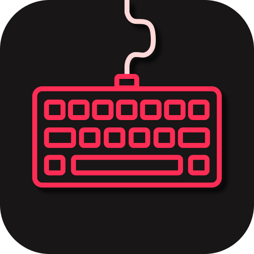
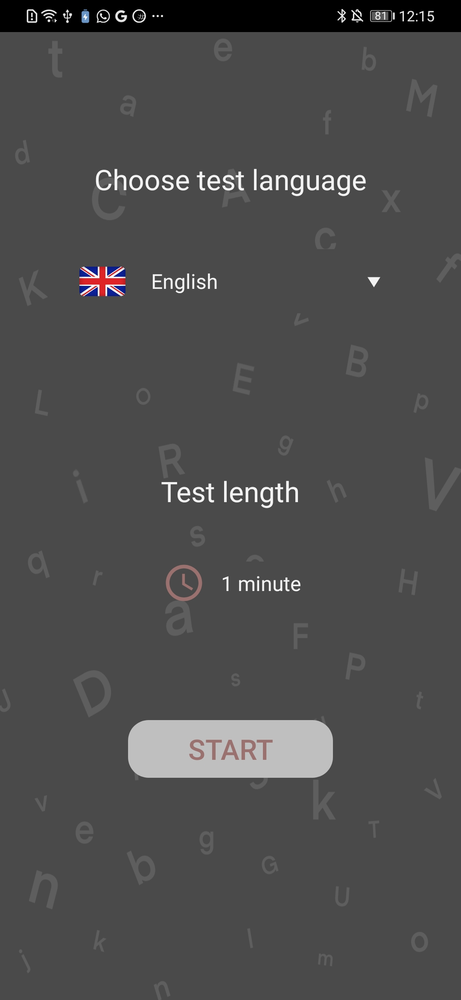
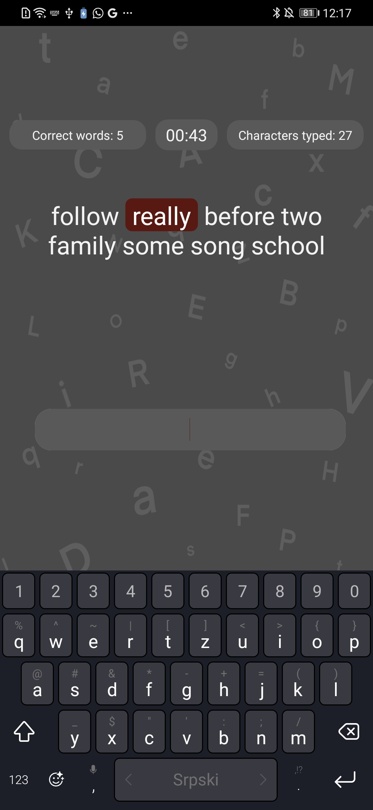
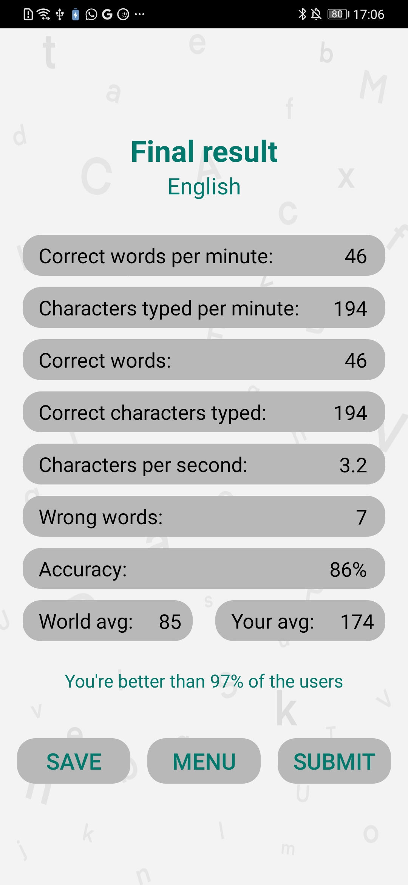
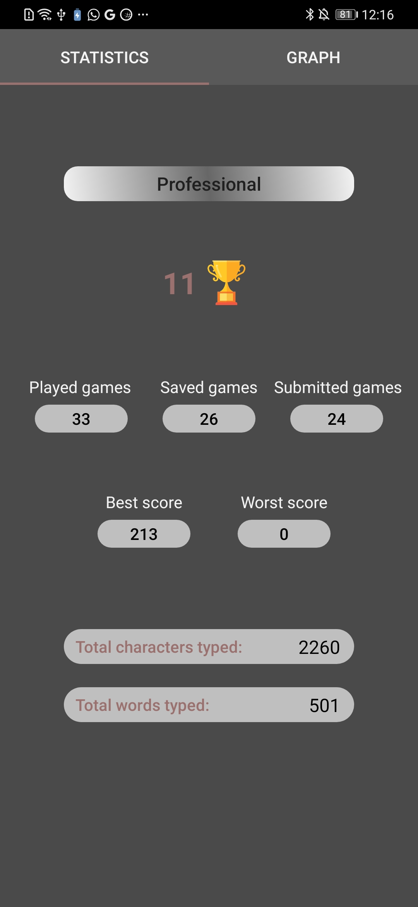
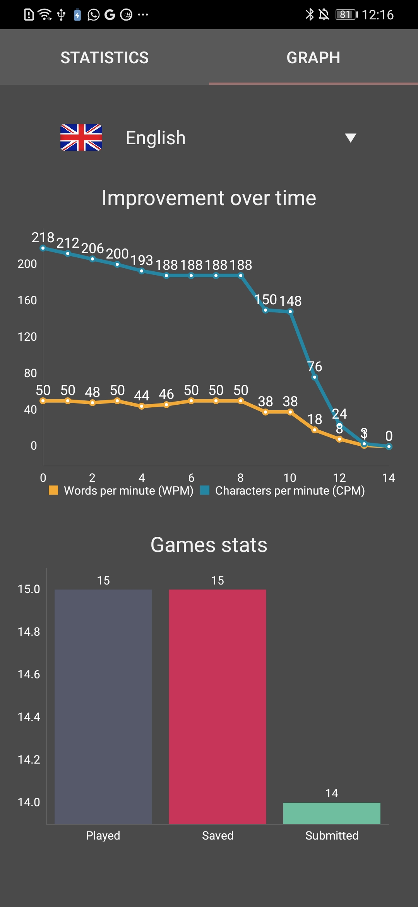

# Fast Typing
This application presents a comprehensive suite of features crafted to enhance your typing experience and elevate your proficiency. Whether you're a novice seeking improvement or a seasoned typist aiming for perfection, our application is tailored to meet your needs.

  

*Please note that the code for this application is private.*

## Features

### Refined Typing Practice
- Engage in dynamic exercises and captivating challenges to enhance your typing speed and accuracy.
- Receive real-time feedback to identify and correct errors as you type.

### Personalization
- Customize your typing environment by selecting your preferred main color in the settings.
- Seamlessly integrate with your device's theme for a personalized experience.

### In-depth Statistics
- Gain valuable insights into your typing progress through detailed statistics, including:
  - CWPM (Correct Words Per Minute)
  - Correct Characters Typed
  - CPS (Correct Characters Per Second, Typing Speed)
  - Incorrect Words
  - Typing Accuracy
  - World Average for Your Selected Category
  - Your Personal Average for Your Chosen Category
  - Comparative Analysis with Other Users

  
  
  
  

## Multilingual Support

Explore 12 categories and 11 languages, including:
1. English
2. Croatian (with and without special characters)
3. Serbian (Cyrillic, Latin with and without special characters)
4. Russian
5. German
6. Italian
7. Spanish
8. French
9. Arabic
10. Hindi
11. Portuguese
12. Numeric Typing (Choose between two keyboard layouts)

## Global Competition

Challenge participants worldwide and join our vibrant typing community! Submit your results to discover your global ranking and compete with the top 10 users in each category.

## Track Your Progress and Achievements

### Result Storage
- Access all your performance data in one convenient location.
- Explore the score section to review your progress.

### Earn Prestigious Titles
- Unlock achievements and earn prestigious titles, including the coveted "Grand Master."
- Review the requirements for each title by clicking on the corresponding box.

## Personal Statistics

Explore My Profile to access an array of insightful statistics:
- Title Achievement
- Trophy Count
- Games Played, Saved, and Submitted
- Best and Worst Performances
- Total Characters and Words Typed

  
  

